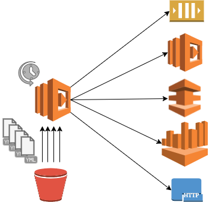

[](https://travis-ci.com/MediaMath/lambda-cron)
# LambdaCron



**LambdaCron** is a serverless cron tool. It provides a way to run scheduled tasks
on AWS cloud and all managed by a command line tool ([LambdaCron CLI](#lambdacron-cli)).

Tasks are scheduled using the same syntax for expressions as linux 
[crontab](https://help.ubuntu.com/community/CronHowto).

**LambdaCron** offer 3 different type of task to run:

* **Queue task**: send message to AWS SQS queue.
* **Lambda task**: invoke AWS lambda function.
* **HTTP task**: send HTTP requests (GET & POST).

Tasks are defined in YAML files and are stored in a S3 bucket.

## LambdaCron CLI

**LambdaCron** providfe a CLI tool that allow to manage you cron tasks from you localhost,
without needing to access to AWS console.

Also it allows to run multiple environments with different settings. As many environments
as desired can be set up.

### Settings

There are 3 levels of preferences for settings:

* Environment: Custom values for an specific environment.
* Global: Custom values that will have effect to all environments created.
* Default: Default value for options in case no custom values are specified (by environment or globally)

Highest level of preference is *Environment*, followed by *Global* and finally *Default*. Each option 
in the settings can set the value from different levels. Higher level of preference overwrite lower levels.

Settings are saved in a YAML file. Each environment is defined with a root key the YAML
as the global settings with the key *global*.

Following are the available options:

#### bucket

Name of the bucket where lambda function code will be hosted and tasks stored.

```yaml
bucket: 'my-custom-bucket-name'
```

You can use the pattern **{environment}** in the string for the bucket, it will
be replaced by the environment name.

**Defualt**: lambda-cron-{environment}

The bucket will have to folders:

* code/
* tasks/

#### every (frequency)

Frequency with which the lambda function that evaluate tasks will run.
It indicates the frequency by **minutes OR hours** with an integer number.
It is specified with one of the following parameters:

* minutes
* hours

```yaml
every:
    minutes: 5
```

**Defualt**: every hour.

More info for [frequency](#frequency)

#### alarm

Alarm can be set up using CloudWatch metrics. It use the following parameters:

* enabled
* email (Required if alarm is enabled).

```yaml
alarm:
    enabled: True
    email: my-mailing-list@email.com
```

**Defualt**: not enabled.

#### enabled

It allows to enabled/disabled the cron.

```yaml
enabled: True
```

**Defualt**: enabled.

#### Example

```yaml
global:
  bucket: 'my-project-cron-{environment}'

prod:
  alarm:
    enabled: True
    email: dev-alerts@domain.com
  every:
    minutes: 5

staging:
  every:
    minutes: 5

dev:
  enabled: False
```

The settings for each environment will be:

* prod:
  * enabled: True
  * bucket: my-project-cron-prod
  * alarm:
    * enabled: True
    * email: dev-alerts@domain.com
  * every:
    * minutes: 5

* staging:
  * enabled: True
  * bucket: my-project-cron-staging
  * alarm:
    * enabled: False
    * email: ''
  * every:
    * minutes: 5

* staging:
  * enabled: False
  * bucket: my-project-cron-dev
  * alarm:
    * enabled: False
    * email: ''
  
### Commands

**LambdaCron** CLI use [aws-cli](https://github.com/aws/aws-cli), every command
is translated into aws-cli command. AWS account should be configured for aws-cli. 
LambdaCron CLI allow to specify different aws-cli profiles.

Following is the list of commands available.

#### create

Create new **LambdaCron** environment in the AWS account.

Parameters:

* **--environment (-e)**: Environment to work with (string)
* **--create-bucket**: Flag to indicate that bucket must be created in S3 (optional)
* **--aws-profile (-a)**: AWS profile to use from aws-cli (string) (optional)

#### update

Update new settings for the environment.

Parameters:

* **--environment (-e)**: Environment to work with (string)
* **--aws-profile (-a)**: AWS profile to use from aws-cli (string) (optional)

#### start

Enable LambdaCron to run.

Parameters:

* **--environment (-e)**: Environment to work with (string)
* **--aws-profile (-a)**: AWS profile to use from aws-cli (string) (optional)

#### stop

Disable LambdaCron, it won't run until it is enabled (#start command)

Parameters:

* **--environment (-e)**: Environment to work with (string)
* **--aws-profile (-a)**: AWS profile to use from aws-cli (string) (optional)

#### invoke

Invoke lambda function cron manually

Parameters:

* **--environment (-e)**: Environment to work with (string)
* **--aws-profile (-a)**: AWS profile to use from aws-cli (string) (optional)

#### delete

Delete **LambdaCron** environment from the AWS account

Parameters:

* **--environment (-e)**: Environment to work with (string)
* **--delete-bucket**: Flag to indicate that the bucket must be deleted from S3 (optional)
* **--aws-profile (-a)**: AWS profile to use from aws-cli (string) (optional)

Note: To delete de bucket it must be empty.

#### upload-tasks

Upload tasks to S3 bucket to run with lambda-cron. It will sync the directory
with S3 deleting tasks have been deleted from the local directory.

Parameters:

* **--environment (-e)**: Environment to work with (string)
* **--directory (-d)**: Path to directory that contains tasks definitions (string)
* **--aws-profile (-a)**: AWS profile to use from aws-cli (string) (optional)

#### validate

Validate a tasks checking if they match with the schema. It can validate a task
from a file or a set of tasks in a directory.

Parameters:

* **--task-file (-t)**: File that contains a task definition.
* **--task-directory (-d)**: Directory with a set of files with taqsks definitions.


## Tasks

Tasks are defined in YAML files, each task in an independent file. Task must follow
the json schema provided in this repo: [schema](./lambda_cron/schema.json).

All tasks must contains following keys and values:

* **name**: task name
* **expression**: crontab expression
* **task**: task definition (customized for each type of tasks)

For each kind of task there a set of specific keys a values to set. Described bellow.

### Queue task

It sends a message to a AWS SQS queue.
The task definition must contains following keys:

* **type**: *queue*
* **QueueName**: Name of the queue (string)
* **MessageBody**: Message to be sent (YAML/JSON)

``` yaml
name: 'Send performance report every morning'
expression: '0 9 * * *'
task:
  type: 'queue'
  QueueName: 'my-scheduler-queue'
  MessageBody:
    name: 'Performance report'
    type: 'report'
    sql: 'SELECT ....'
    recipients:
      emails: ....
```

Message is sent using [boto3 SQS.Queue.send_message](http://boto3.readthedocs.io/en/latest/reference/services/sqs.html#SQS.Queue.send_message)
All parameters of the function will be supported soon.

### Lambda task

It invokes an AWS lambda functions.
The task definition must contains following keys

* **type**: *lambda*
* **FunctionName**: Name of the lambda function to invoke (string)
* **InvokeArgs**: arguments to send (YAML/JSON)

``` yaml
name: 'Run ETL process every hour'
expression: '0 * * * *'
task:
  type: 'lambda'
  FunctionName: 'run-etl-process-prod'
  InvokeArgs:
    source: 's3://my-data-source/performance'
    output: 's3://my-data-output/performance'
```

Function is invoked using [boto3 Lambda.Client.invoke_async](http://boto3.readthedocs.io/en/latest/reference/services/lambda.html#Lambda.Client.invoke_async)

### HTTP task

It send and HTTP request (GET or POST).
The task definition must contains following keys:

* **type**: *http*
* **method**: http method (get | post)
* **request**: YAML with parameters to send for the selected method using [Requests](http://docs.python-requests.org/en/master/)

``` yaml
name: 'helth check every hour'
expression: '0 * * * *'
task:
  type: 'http'
  method: 'get'
  request:
    url: 'http://helthcheck.my-domain.com'
    params:
      service: 'lambda'
```

It is a wrapper over [Requests](http://docs.python-requests.org/en/master/).
All http methods will be supported soon.


## Requirements

* Python 2.7
* boto3
* pip
* AWS account
* awscli (configured)

**LambdaCron** is based 100% on AWS cloud.

## Frequency

When setting up the frequency of **LambdaCron** you must have into account following things.

####  Higher frequency is 1 minute

Events are based on [AWS CloudWatch Events](http://docs.aws.amazon.com/AmazonCloudWatch/latest/events/WhatIsCloudWatchEvents.html).
You can read in following [documentation](http://docs.aws.amazon.com/AmazonCloudWatch/latest/events/ScheduledEvents.html):

* "The finest resolution using a Cron expression is a minute"
* "Your scheduled rule is triggered within that minute, but not on the precise 0th second"

Be aware of this.

####  Higher frequency for a task is LambdaCron frequency.

It means that if LambdaCron run every hour and the task expression is set for every 15 min. the task
will run once an hour. When LambdaCron runs it will executed all tasks scheduled for the period of
time until next execution.

For example, if LambdaCron runs every hour (at mininute 00) and there is a task scheduled for minute 30, it will
run at minute 00. LambdaCron will run again next hour.

## Getting Started

Clone this repo

``` bash
$ git clone https://github.com/mediamath/lambda-cron.git
```

Install dependencies (you can use a virtualenv):

``` bash
$ pip install -r requirements.txt
```

Create your first environment (called 'test') with default settings:

``` bash
$ lambda-cron create --environment=test --create-bucket
```

If you want to set some custom settings, create the setting file in the home
directory of the user who is running the tool.

* ~/.lambda-cron.yml

For help:

``` bash
$ lambda_cron/lambda-cron --help
```

or for each command:

``` bash
$ lambda_cron/lambda-cron create --help
```


## TODO

Features/Improvements that would like to implement some time soon.

* Be able to disable tasks
* Index file to know which tasks must runs and avoid read all of them
* Support all parameters for [boto3 SQS.Queue.send_message](http://boto3.readthedocs.io/en/latest/reference/services/sqs.html#SQS.Queue.send_message)
* Support all HTTP methods in [Requests](http://docs.python-requests.org/en/master/)
* Improve CLI output.
* Add new commands:
  * Manage/show logs
  * Check state
* Create LambdaCron package to be installed with pip
* Nested setting files
* Add test for handler function
